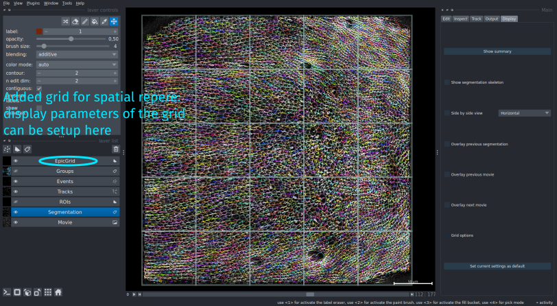

!!! abstract "Display settings :window:"
	_Select the `Display` ongler or use dedicated shortcuts to setup the display_

You can manage the display with several shortcuts to be able to rapidly switch the current view, but also some general options are available in the interface in the `Display` onglet.

* `Measure line` option, can be started with <kbd>Control+i</kbd> to measure the length of a drawn line. Press the shortcut, then draw the line by left clicking and dragging the line. When you release the mouse button, the line will disappear and the measure of its length will be displayed in the top left part of the window.
* `Show summary` opens a pop-up text window that contains general information about the movie as the size of the movie, the number of cells, the average cell area, the average track duration..
* `Side by side view`: by default all layer are overlaid. To split the layers in two side by side view, select the `side-by-side view` parameter and choose the views to be placed horizontally or vertically. Uncheck it to be back to a single view.
* `Set current settings as default`: save all the current settings (display parameters, option parameters) in the settings file so that next time EpiCure is loaded, it will be in the same state. 
For example, if you preferably look at the segmentation with only contours visible with a given width, it will directly load it to this state.

## Segmentation skeleton

The cell segmentation is shown as labels (cells are fully colored by a unique number). The skeleton only shows the boundaries between cells. The option `Show segmentation skeleton` will add a layer that contains a binary representation of the cell junctions. :round_pushpin: **Press <kbd>k</kbd> to show/hide the skeleton layer.**

## Grid options

This option displays a regular grid on top of the layers, to have a spatial reference of the area already corrected/treated. The number of rows and columns of the grid can be chosen in the `Display>Grid options` panel as well as the size of the displayed lines of the grid (`Grid width` parameter).

When `Add grid` is clicked, the grid is visible and a layer `EpicGrid` is added in Napari. By selecting this layer, it is possible to change the grid display style. Select the selection tool (full arrow) and click on <kbd>a</kbd> to select all lines of the grid and change the color/size with the top left panel of Napari. Each case of the grid is named `A0`, `A1`... to keep track of the position of each cell. The text can be hide/show by clicking on `display text` in that top left panel.

:round_pushpin: **Press <kbd>g</kbd> to show/hide the grid.**

