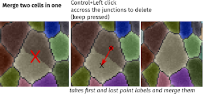
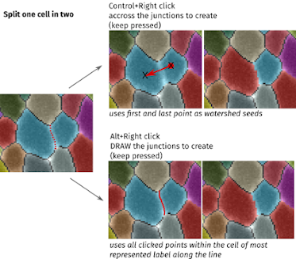
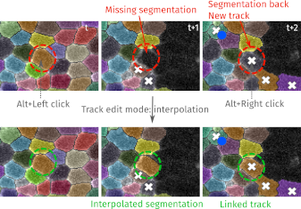
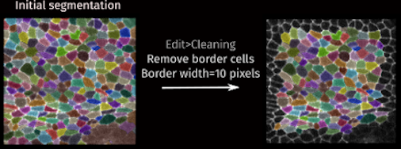
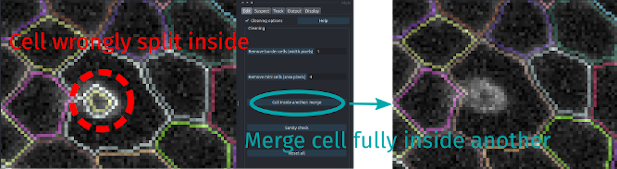
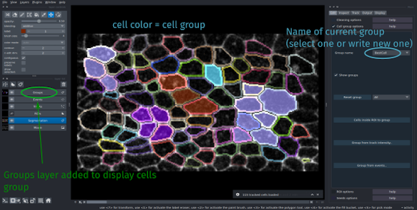
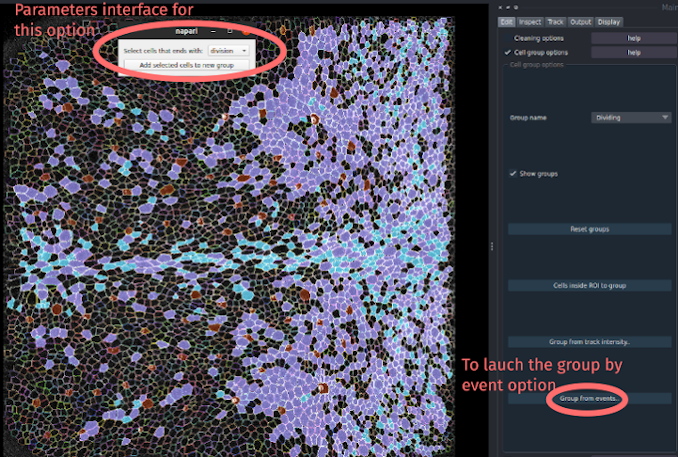

!!! abstract "Edit the segmentation or cell properties"
    _Most edition options are in the Edit tab of the Main interface_

EpiCure offers several features to ease the manual correction of the segmentation and tracking of the cells ([see correction options](#segmentationtracking-correction)). 

Additionnal features are proposed:

* [Cleaning options](#cleaning-options): general cleaning/checking of the segmentation and EpiCure files to ensure.
* [Group cells options](#group-cells-options): classify cells into group (type) of cells.
* [ROI options](#roi-options): apply some process to only some drawn region.
* [Seeds options](#seeds-options): to perform a watershed segmentation from several placed seed points.:heavy_division_sign: 

## Segmentation/tracking correction
**:material-vector-point-edit: Single frame edition:**  EpiCure offers several options/shortcuts to ease the manual correction of the cell segmentation.
The correction can be done on a single time frame (the current one) or it can concern a whole track.
By default, the shortcuts for single time frame correction are activated (if the layer `Segmentation` is selected).

**:material-vector-polyline-edit: Track level edition**: To perform a track level edition, first press <kbd>t</kbd> to go into `track mode` and use the track level shortcuts.
A message should appear to confirm that the track edit mode is active.
:warning: _The other shortcuts are not active anymore in the `track mode`, only the shortcuts listed in the track mode table._ To leave this mode and reactive the usual shortcuts, either finish your edit or press <kbd>t</kbd> again. 
After the action linked to a shortcut has been done, the `track mode` is automatically existed. 

### Shortcuts
The segmented cells are represented as label. There are several possibility for label edition in `Napari` + extra features from `EpiCure`.
General shortcuts are documented [here](index.md/#general-options).
You can see the complete list of Napari label layer shortcuts by going to `File>Preferences>Shortcuts` and selecting `Label layer`.

???+ tip "Shortcut/options"
    
     _See Napari Label layer [documentation](https://napari.org/0.5.0/howtos/layers/labels.html) for the label edition tools available by default in Napari (and the top left panel of the interface)_

     _**EpiCure shortcuts are only active when `Segmentation` layer is selected**_

	=== "Segmentation correction :wrench:"
	
		|   |     |	
		| ------------ | ------------------------------------ |
		| <kbd>Ctrl</kbd>+:material-mouse-left-click-outline: | Merge two neighboring cells. Click and keep the button press from the first cell until the second cell. _(See the image merging below.)_ _Note that if the two cells are not touching, they cannot be merged_ |
		| <kbd>Ctrl</kbd>+:material-mouse-right-click-outline: | Split the cell accross the click. _(See splitting image below)_. Drag-click accross the junction to create (from middle of the first cell to the middle of the second one). The first point of the click and the last one are used as seeds for an intensity-based watershed separation. _Changing these two extreme points (seeds) can then improve the splitting_ |
        | <kbd>Alt</kbd>+:material-mouse-right-click-outline: | Split the cell along the drawn click. _(See image splitting below.)_ Draw the junction, keeping the mouse pressed to split along the drawn line. _If the drawn line spread over neighbor cells, it will not affect them_ |

	
    === "Segmentation drawing :paintbrush:"
	
		|   |     |	
		| ------------ | ------------------------------------ |
        | <kbd>2</kbd> | Switch to drawing mode (or click on the pencil tool). When it's selected, it will draw with the current value in the field below. _The preicision (size) of your drawing can be set with `brush stroke` parameter_ |
        | <kbd>[</kbd>/<kbd>]</kbd> | decrease/increase the brush stroke size |
        | <kbd>3</kbd> | Switch to fill mode. The `fill` option replace directyl a whole label with the current new value.|
        | <kbd>4</kbd> | Switch to label selection mode (picker). Set the current painting value ot the value of the clicked cell |
        | <kbd>m</kbd> | Put the current drawing value to the maximal value +1. That unsures it's an unused value and can be used to draw a new cell. |
        | <kbd>n</kbd> | Set the current drawing value to the first unused value and switch to paint mode |
        | <kbd>Shift+n</kbd> | Set the current drawing value to the first unused value and switch to fill mode |
        | `preserve_labels` | Freeze other labels than the current painting value. It's not possible to paint over an other value, so it ensures that you don't "damage" other segmentations when you edit one. |
        | <kbd>p</kbd> | Toggle on/off the `preserve_labels` option |
        | :material-mouse-right-click-outline: | Delete a cell. You can also put `0` as the current label, select `fill` mode and click on the cell to remove. |
        | <kbd>w</kbd>, then <kbd>Ctrl</kbd>+:material-mouse-left-click-outline: | From one cell to another to swap their values. |
        | <kbd>j</kbd>, then <kbd>Ctrl</kbd>+:material-mouse-left-click-outline: | draw one of several contiguous junctions to create new cell(s), defined by already existing cells around and this line |

    === "Track level editing :material-vector-polyline-edit:"
        _ <kbd>t</kbd> activates track mode_
	
		|   |     |	
		| ------------ | ------------------------------------ |
        | <kbd>t</kbd>, then :material-mouse-left-click-outline:, then :material-mouse-right-click-outline: | Link the two tracks under each click into one track (spatially or temporally). _Merging spatially_: if two tracks from the same time frame are clicked, the corresponding cells on all following frames will be merged into one cell (track). _Merging temporally_: if the two clicked cells are not in the same frame, the track will be merged temporally into one. If one clicked cell is not the last or first of its track, or if they are not in consecutives frames, the merging will be refused. Split the tracks before in that case. |
        | <kbd>t</kbd>, then <kbd>Shift</kbd>+:material-mouse-right-click-outline: | Split a track at the clicked position. A new track will be created from the current clicked frame to the last frame of the initial track. |
        | <kbd>t</kbd>, then <kbd>Ctrl+Alt</kbd>+:material-mouse-right-click-outline: | Erase all the remaining track starting from the current frame (erase all the painted cell).|
        | <kbd>t</kbd>, then <kbd>Shift</kbd>+:material-mouse-left-click-outline: | Keep clicked from one cell to another, to swap the two tracks value from the current frame until the end of each track.|
        | <kbd>t</kbd>, then <kbd>Ctrl</kbd>+:material-mouse-left-click-outline: | Manual tracking: at the first click, get the current cell value under the click and go to the next frame. At each new click, the initial value is set to the new cell and the viewer advanced to the next frame. Allows to manually define a track frame by frame.|
        | <kbd>t</kbd>, then <kbd>Ctrl</kbd>+:material-mouse-right-click-outline: | Finish the manual tracking|
        | <kbd>t</kbd>, then <kbd>Alt</kbd>+:material-mouse-left-click-outline:, then <kbd>Alt</kbd>+:material-mouse-right-click-outline: | Interpolate the segmentation between the two clicked cell. _See image interpolate below_. If segmentation is missing in one (or more) frame, this option interpolate the segmentation in between and add them to the track. _Note that the interpolated segmentation is drawn only where the initial segmentation is black (background). If other labels are present in the interpolated area, it will not be affected_ |
        
Merging cell :material-vector-point-edit::

Splitting cell :material-vector-point-edit::

Interpolate in track :material-vector-polyline-edit::
 

---

## Cleaning options

Options to ensure clean and correct EpiCure files.

### Remove border cells
**Remove all segmented cells that touch the spatial borders of the image.** This parameter allows to get rid of cells that are partially outside of the imaged region and thus not complete. 

The parameter `Border width` allows to extend the requirement for the cells to be considered as fully inside. Cells that have at least one pixel at a distance less than `Border width` pixels from the image limits will be removed. 

Note that this action will be applied to all the time frames of the movie, and cannot be cancelled (if you wish to cancel it, you then need to restart EpiCure without saving the files). 

<figure markdown="span">

<figcaption>Remove border option</figcaption>
</figure>

### Remove mini cells

**Allows to remove all cells smaller than the chosen threshold.** The cell size is its area in pixels (number of pixels inside the cell). When this button is clicked, all frames will be treated.

### Cell inside another: merge

**Merge all cell fully included in another one into it.**

One recurrent segmentation error can be a large cell wrongly split in two cells, with one (false split) inside the other (correct one). This kind of error occurs when there is a large bright spot inside a cell, as for example into SOP (Sensory Organ Precursor) cells. 

<figure markdown="span">

<figcaption>Merge cells that are inside another bigger one.</figcaption>
</figure>

### Sanity check :white_check_mark:

**This option performs several checks to ensure that the files follows EpiCure's standards and can fix some errors.**

For example, the tracks must not have frame gaps (missing one frame). If that happens, the `sanity check` option will detect it and fix it by splitting the gap in two different gaps.
If some napari layers had been wrongly closed, this step will also re-open them.
It also checks if the labels seemed ok or if something is weird.

---

## Group cells options

**Allows to create group of cells (classify them).** Cells can be manually assigned to a cell group by clicking on them. This is useful to distinguish different type of cells visually or/and in the analysis in the Outputs options.

`Group name` allows to choose the name to give to a new Group of cells, or to assign a cell to the current `Group name` group. Write a new name to enter a new group, or choose in the list an existing group to insert the cell in that group.

Cells can be manually assigned to the current group (see shortcuts below).

???+ tip "Shortcut/options"

    === "Group"

    |   |     |
    | ------- | ------------------------------- |
    |<kbd>Shift</kbd>+:material-mouse-left-click-outline: | Assign the clicked cell to the current group (defined in `Group name`) |
    |<kbd>Shift</kbd>+:material-mouse-right-click-outline: | Remove the click cell from its current group (the cell will not be in a group anymore) |
    | `Show groups` | Add a `Groups` layer in Napari, in which the cell are colored by the group they are in. Cells that are not in any group are black. |
    |`Reset groups` | Remove all created groups. All cells are not in any groups. |

<figure markdown="span">

<figcaption>Group options interface</figcaption>
</figure>

When the segmentation is **saved by clicking on <kbd>s</kbd>** when the `Segmentation` layer is active, the group information is also saved, in the EpiCure data file (file in the `epics` folder that ends with `_epidata.pkl`. When the movie is reopened in EpiCure, it will be automatically reloaded. 

### Automatic cell group assignement

Options are proposed to automatically assign several cells into one group.

`Cells inside ROI to group`: assign all the cells that are inside the currently selected ROI in the current frame (in the `ROIs` layer) to the current group (set by `Group name`). Cells that are assigned to a group are assigned all along the track (in all frames where this cell is present).  

#### Group cells based on intensity measurement.
To set this option, click on the `Group from track intensity...` button in the `Group options` panel.
It opens-up an interface that allows to choose the criteria for the cell classification.

The positive cells based on the selected criteria will be assigned to the current group name that can be set in the `Group name` parameter in the main interface.

Choose the layer to use for the classification: the intensity in this layer will be measured in each cell. The layer can be a non EpiCure-layer . It only have to be opened in the same Napari and put at the same scale.
For example it can be a probability map that are calculated by [DeXtrusion](https://gitlab.pasteur.fr/gletort/dextrusion). In the notebook [EpiCure_DeXtrusion_Interaction.ipynb](https://gitlab.pasteur.fr/gletort/epicure/-/blob/main/notebooks/EpiCure_DeXtrusion_Interaction.ipynb?ref_type=heads) in this repository, dextrusion probability maps are overlayed with the EpiCure data and used to automatically classify SOP cells if they have been detected by DeXtrusion.

For each track, the intensity will be measured in all the pixels of the cell at each time frame. You can choose whether you want to measure the mean value of these intensities, or the sum/max/min/median. Then fix a threshold to consider the track as positive if the measured value is above this threshold.

#### Group cells according to events (dividing/extruding)

This option allows you to automatically group cells that will divide or extrude into a `Dividing` or `Extruding` group (or other group for other events).
Click the `Group from events...` button to open the parameter interface of this option.
You can choose which type of events to use to classify the cells.
Click on `Apply` to automatically set all the cells that divide (or extrude, or other event types) into the `Dividing` group (or `Extruding`).

If the option `show groups` of the main panel is selected, you will directly see which cells were assigned to this group when the processing will be finished.

<figure markdown="span">

<figcaption>Group cells that divide</figcaption>
</figure>

---

## ROI options

This option allows to do operations on several neighboring cells at once, by selecting a region.

### Draw a selection/Region of Interest :white_square_button:

When you select the `Selection option` in the `Edit` panel, press the first button `Draw/Select ROI` to draw a new shape or select an existing one. The shapes should be in the `Drawings` layer, by default not visible. When you click on this button, the layer will be visible and active.

Choose the drawing tool that you want (ellipse, polygon, rectangle, triangle), the shape should be a closed one (so not a line). Draw the contour of the region that you want to use. The selected cells will be all the ones that have their centroids inside the drawn shape in the current frame. 

If the selected cells (labels) are present in other frames (tracking has been done), they will also be selected.

### Remove cells inside ROI

This will remove all the cells that are inside the currently selected shape/ROI. However, if some of those cells are "checked", they will not be removed.

If no shape is selected, but there is exactly one shape in the `Drawings` layer, this shape will be selected. Otherwise, an error message will show off.

---

## Seeds options

**This option performs an automatic segmentation of cells starting from manually placed points (seeds).**

### Manual positioning of seeds

To place/add seeds, you can either check the `Seed options` parameter in the `Edit` panel, press `create seeds layer` if it's not there yet and select the `+` button in the top left panel to add points. 

_Shortcut_: You can directly press <kbd>e</kbd> when the `Segmentation` layer is active, and each <kbd>left-click</kbd> will place a new seed if there is no cell below. <kbd> right-click</kbd> to stop adding seeds.

### Automatic positioning of seeds from previous time point

In the case of movies, we can use the information from the previous frame to place the seeds in the region that are not segmented yet. This option `Load seeds from previous time point` simply takes the centers of each cell of the previous frame as a seed.

### Automatic segmentation from seeds
Several methods to segment the cells from the seeds are proposed:
* Intensity-based: classic watershed method, starting filling from the seeds and stopping at high intensity gradient 
* Distance-based: purely based on the distance to the seed points, voronoi-like segmentation.
* Diffusion-based: random walk approach from the seeds. The segmentation is spread by diffusion from the seeds through similar intensity pixels in the image (sensitive to both the distance and the intensity).

The parameter `max cell radius` controls the maximum cell size. It will constrained the segmentation for the `Distance-based` method and is used to crop the image around the seeds for computation efficiency with the two other methods.

Select the segmentation method and click on `Segment cells from seeds` to run it. 
