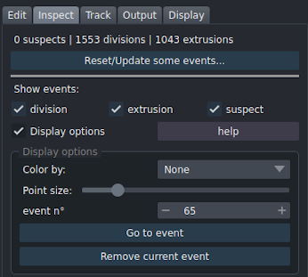
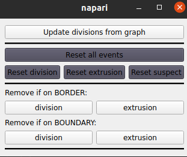
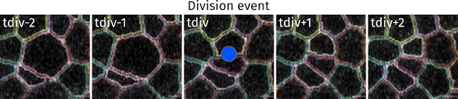
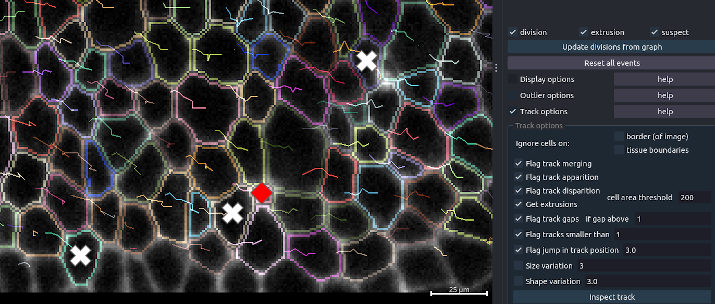

!!! abstract "Inspect segmentation/tracks to reveal potential errors - Handle events"
	_Options to detect potential errors and navigate through them. Display also events as cell division and extrusions_


In EpiCure, an event is a point (a cell at a given time point) that has been detected as potentially wrongly segmented/tracked and might need manual correction (suspect) or that corresponds to a cellular event (division, extrusion..).

Several features allows to detect possible segmentation/tracking errors and to display and navigate through these potential errors.

* [Division events](#division-events)
* [Extrusion events](#extrusion-events)
* [Find suspects on a single frame](#frame-based-suspects)
* [Find suspects by track inspection](#track-based-suspects)
* [Visualisation/display](#visualisation)

All the current eventts are kept and saved when the segmentation is saved (by pressing <kbd>s</kbd>). They will be reloaded when an EpiCured file is loaded. The current number of events is indicated on top of the `Events` panel.



To remove all events, click on `Reset/Update some events...`. A new window will pop-up to let you choose which events to reset or update.



Click on `Reset all events` to delete all events. You can also choose to delete only one type of event by clicking on the corresponding buttons below.

To remove events (division or extrusion) that correspond to cells that are on the border of the movie or on the boundary of the tissue, choose the options `remove if on border` or `remove if on boundary` and click on the corresponding type of event to remove.

---

## Division events

Division events are detected based on the tracking graph. If cells has not been tracked yet, no division will be found. Division are indicated by a blue circle, placed on the first frame where the two daughter cells are visible and it contains the information of the mother cell label.



(Un)Select the option `show division` to (un)display division events. You can see the total number of divisions found written in the top of the `Inspect` panel.

You can manually add a division event, or remove one.
* To remove a division, the shortcut is the same as for removing any event: by default, press <kbd>Control+Alt+Right-click</kbd> on the event to remove.
* To add a divison, do <kbd>Control+Shift+Left clikc</kbd> from one daughter cell to the other. EpiCure will detect automatically the most likely mother cell.
If suspect events had been found on the two daughter cells or on the mother cell, they will be automatically removed when manually adding the division.


## Extrusion events

Extrusions are indicated by a red cross, placed on the last frame where the cell is still visible.

Extrusion events are detected with the `Inspect` panel, in the inspect track option.
It detects track that suddenly disappear (no daughter cell, not on the last frame, and not on the tissue boundary if the option `ignore boundary cells` is checked).
As a sudden disparition of a track can also be due to a segmentation/tracking error, we added a constraint on the size of the cell to consider the disappearance as an extrusion.
The cell in the last frame before disappearance should indeed be small if it is an extrusion.
The threshold of cell area to consider it as an extrusion is chosen with the `cell area threshold` parameter.

---


## Track-based suspects

__Flag suspicious segmentation based on track examination.__



### Ignoring border cells

Cells on the border of the tissu or imaged field are often flagged as potential errors as they can leave/enter the imaged region and thus have irregular tracks. To not flag these cells, check the `Ignore cells on` `border (of image)` and/or `tissue boundary` options.
This will not flag any cells that touch the border of the image (for the `border` option) or that are in the periphery of the tissu (for the `boundary` option). 
_Note that you can also know when analysing data which cells are on image border or tissue boundary in the `Output>measure cells` option if you select the `Boundary` and `Border` features._

### Possible errors detection

`Flag track apparition` detects the sudden apparition of a new track in the movie (not on the first frame, and not on the borders of the image). If the cell is marked as a child of a division at that frame, it will not be flagged. (If two neighbor tracks are flagged in the same frame, it is likely to be an undetected division event)  

`Flag track disparition` detects the sudden disappearance of a track in the movie (not on the last frame). If the cell is marked as a parent of a division, it will not be flagged. If the cell area is below the selected threshold in the `cell area threshold` parameter, it will considered to be an extrusion and not be flagged.

`Get extrusions` will add an `extrusion` event for all track that finish without being followed by a division and with the last cell area below the `cell area threshold` parameter. Tracks that are only 1 frame long (cell is only present in one frame) are not flagged for an extrusion.


`Flag track gaps` find track that have gaps (no label in one or more frames within the track). If the option `Allow gaps` in the `advanced parameters` in the starting interface was not selected, there should not be any gaps.

`Flag track smaller to` flags as possibly wrong all tracks that are smaller in duration (number of frames) than the chosen parameter. For example, a cell that is present only in one frame on the whole movie is likely an error (except on the movie limits).

`Flag jump in track position`: a convenient way to notice errors in tracking or segmentation is to display the tracks (by default <kbd>r</kbd> shortcut). Errors are noticeable as sudden jump in the track (long line between two frames). This option is automatically searching for such jump in position within a track.
The displacement between two consecutive frames of the tracking (can include a gap) is compared to the local average displacement within the track. If the difference in displacement is `jump in track position parameter` threshold above the other displacements, it will be flagged.
Increase the value of the threshold to detect less potential jump in the track.


A brutal and temporary (one or two frames only) change of value of a morphological/intensity feature of a cell within the track can reflect a segmentation error.
The options `* variation` allow to flag such events. The associated parameter correspond to the amount of variation of the feature to flag it as suspect. Increasing it will decrease the sensitivity of the track inspection. The features that can be examined along the track are currently: size (area), shape (aspect ratio).


### Inspect tracks

Click on `Inspect track` to launch the analyse with the selected parameters. It will delete all previously present suspects based on track before to run. Frame-based suspects are not affected.

When the process is finished, the number of `suspects` will be updated in the top of the panel and you can see each event as a point (a cross for suspect, circle for division and triangle for extrusions) in the corresponding position in the movie. 


## Visualisation

:round_pushpin: **Press <kbd>x</kbd> to show/hide the suspect points.**

### Events layer

This layer contains points (shown as cross) placed at the center of each cell suspected of being not correctly segmented. Several features can be used to detect suspects, either from a static features [`see frame-based suspects`]("frame-based-suspects") or from analyzing the tracks [`Track options`](#track-based-suspects). Cellular events are also displayed in this layer. Divisions are marked with blue circle by default.

The score of a suspicious event is the number of suspicion (features) associated to that cell.

### Display options

Use the interface `Display options` in the `Inspect` onglet (right panel) to change the display of the points (the size or the color). 
You can choose the reference feature for coloring the events. If a cell was suspected by the selected feature, the point will appear red, otherwise if the suspicion came from another feature, the point will appear white. The `score` feature shows the number of suspicions (features) associated to the cell from white (1) to bright red (maximum).

`Go to event` will zoom on the selected event (numbered in `Event n°` parameter) and print in the Terminal window why this point was flag as a possible segmentation mistake or which cellular event it is. :round_pushpin: **<kbd>Ctrl+Alt+Left click</kbd> on a point to zoom on it and displays suspicion information**

To directly navigate between suspects, :round_pushpin: **Press <kbd>Space</kbd> to move from one suspect to another**. The view will directly to go to the next suspect, zoom on it, and displays the information in the terminal. It will navigate between events that are currently displayed, other events will be skipped.

If the segmentation/tracking is in fact correct, you can remove the point by clicking on `Exonerate current event`. :round_pushpin: **<kbd>Ctrl+Alt+Right click</kbd> to remove the clicked point from event list**

## Shortcuts

EpiCure proposes also shortcuts to handle events (edit, navigate, display) without having to select this layer, keeping the `Segmentation` layer selected.
General shortcuts are documented [here](index.md/#general-options).

???+ tip "Shortcut/options"

     _**EpiCure shortcuts are only active when `Segmentation` layer is selected**_

	=== "Event navigation :mag:"
	
		|   |     |	
		| ------------ | ------------------------------------ |
		| <kbd>Ctrl+Alt</kbd>+:material-mouse-left-click-outline: | Zoom on the clicked event and display its information. The information (type of event, label) is written in the Terminal window. |
		| <kbd>Ctrl+Alt</kbd>+:material-mouse-right-click-outline: | Remove the event under the click. |
		| <kbd>Space</kbd> | Move and zoom on the next event. This option navigates between events that are currently displayed (checked). |

	=== "Event edition :wrench:"
		
		|   |     |	
		| ------------ | ------------------------------------ |
		| <kbd>Ctrl+Shiftt</kbd>+:material-mouse-left-click-outline: | Add a division. Drag the click from one daughter cell to the other. EpiCure will determine the most likely mother cell.|
		| <kbd>Ctrl+Shiftt</kbd>+:material-mouse-right-click-outline: | Add an extrusion. Click on the last cell of the track to select the moment of extrusion.|


---

## Frame based suspects

Cells can be suspected of being un-correctly segmented based on several static features, if their values fall out of range.
When a cell is suspected, a point will be added in the [Suspects](#visualization) layer at the center of the cell in the frame where the suspicion has been raised.

From a static frame, several features can be measured and evaluated for out of range values:

* [Cell area](#cell-area)
* [Tubeness](#tubeness)
* [Solidity](#solidity)
* [Intensity](#intensity)

Click on the desired feature button to launch the feature inspection.

### Options

`only current frame`: if it is checked, only the current frame will be inspected for the given feature. Else, the inspection will be done on each frame.

### Shortcuts

The active layer must be the `Segmentation` layer for the shortcuts to work.

### Cell area

This feature measure the cell area in all frames (or only current frame if the option is checked) and test if it is above/below chosen threshold.
Each cell (at each time point) below/above the two parameters around the `< area (pix^2) <` buttons will be flagged as suspect for area.

The parameters are in pixel^2 unit. Use `0` for the min area parameter to keep all small cells, and a very high value for the max area parameter to keep all large cells.


### Intensity

This feature consider the ratio of intensity of the inner cell region compared to the cell periphery. Indeed, the peripheric part of the cell containing the junction should be much brighter while inside the cell should not be dark. If the ratio is above the chosen threshold, the cell will be marked as suspicious.

### Tubeness

This feature consider the ratio of linearity of the inner cell compared to the cell periphery. Indeed, the peripheric part of the cell containing the junction should be linear while inside the cell it should not be linear at all. The "linearity" is quantified by the tubeness of the intensity image. When the ratio is above the chosen threshold, the cell will be marked as suspicious.


### Solidity

Looks at the cell shape.
Cell as detected as outliers if their solidity is greater or smaller than the vast majority of the cells **in the current frame** following Tukey's outlier scheme:

```plaintext
solidity < Q1 - k*(Q3-Q1)
solidity > Q3 + k*(Q3-Q1)
```

`Q1` and `Q3` are the 1st and 3rd quartiles. `k` controls the range to consider a cell as outlier and can be chosen in the interface.


---
