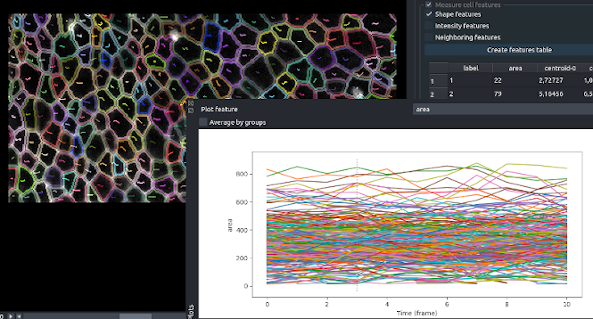
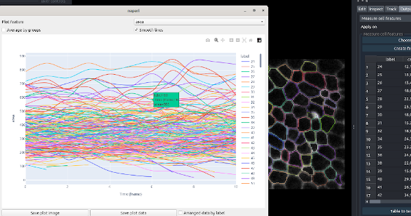
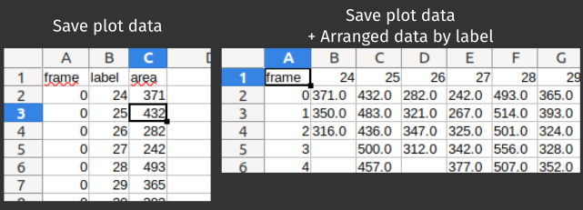
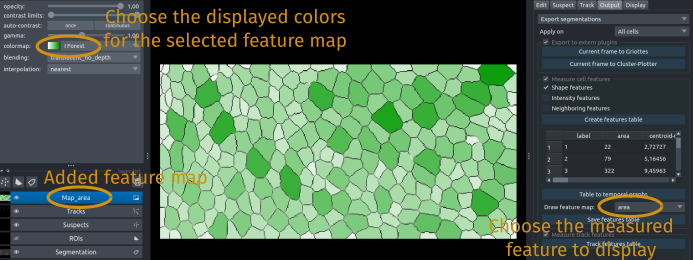
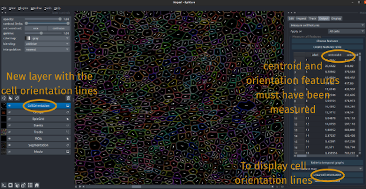
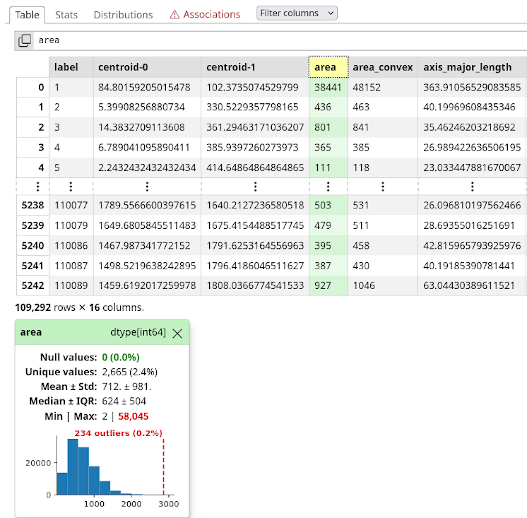

!!! abstract "Options to measure and export segmentation/events/tracks"
	_Measurement and plotting options are/will be proposed here, as well as options to export the segmentation/measurements to use in other analysis softwares_

* [Apply on: define current selection](#define-current-selection)
* [Export to extern plugins](#export-to-other-plugins)
* [Export segmentations](#save-segmentations)
* [Export events](#export-events)
* [Measure cell features](#measure-cell-features)
* [Measure track features](#measure-track-features)

## Define current selection

You can choose which cells to analyse/export with the `Apply on` option in the interface:
* `Only selected cell` will measure/export only the currently selected label/cell. Its value can be seen and modified in the left panel under `label`. You can select `show selected` option in that panel to see only this cell.
* _`GroupName`_ will measure/export all the cells in the corresponding Group (that have beend defined with the `Edit>Group` options. To see which cells are in the group, you can select the option `see group cells` in the `Edit>Group` panel of Epicure.
* `All cells` will measure/export all the cells in the `Segmentation` layer.

---

## Export to other plugins

The output of EpiCure are also compatible with other Napari plugins, and this panel allows you to communicate directly with those plugins. It will open a new Napari window, with the corresponding plugin launched, and the necessary layer. You need to have these plugins already installed in Napari, or install them in the `Plugins` panel of Napari.

Currently, we propose direct export to:
* [Griotte Napari plugin](https://www.napari-hub.org/plugins/napari-griottes) that allows to visualize/export the connectivity graphs between the cells.
* [Cluster-Plotter Napari plugin](https://github.com/BiAPoL/napari-clusters-plotter) that allows to cluster objects based on their properties and interactive visualisation of the results.

---

## Save segmentations

The curated segmented and tracked file can be exported in several formats to be used directly in other softwares/pipelines.

Click on the check box on top of the `export segmentation` panel to remove it when you don't need it anymore.

### ROI export

The button `Save ROI(s)` allows to export the segmentation as Fiji ROIs. It will export only the selected set of cells (the selected cell, the checked cells or all the cells). In all cases, it creates **a ROI file for each cell**, containing the contour of the cell at all time frames where it is present. The file(s) are saved in the output folder, named `*imagename*_cell_*celllabel*.zip`, for each cell.

### Save segmentation

The button `Save segmentation(s)` allows to save the label image of the segmented cell(s) depending on the selection (only the selected cell, cells in a given group or all the cells).

### Save skeleton

Allows to save the skeleton: the binary of the junctions, of the current selection (only selected cells, cells of a given group, or all cells). The file will be saved in the output folder.
The skeleton can also be displayed by pressing <kbd>k>/kdb> when the segmentation layer is active.

---

## Export events

Export events (in the `Inspect` onglet) to use in extern plugins/softwares as `Fiji`. 

You can choose which type of events to export (suspect events, divisions, extrusions...). For this click the `Choose events` button and select the event types to export. Each type of event will be exported separately.

Then choose the type of format to export the event.
Currently, only `Fiji ROI` is proposed. It will save the list of events as `Fiji point ROI` in a `.zip` file which can be open in Fiji through the `ROI Manager`. This export format is also compatible with [`DeXtrusion`](https://gitlab.pasteur.fr/gletort/dextrusion) so that EpiCure can be used to create a training dataset for DeXtrusion.

---

## Measure cell features

### Features selection

You can choose which features will be measured and displayed in the table. For this, click on the button `Choose features` in the panel. A window will pop-up with the list of available features. Check the ones to measure. 
If features that relies on intensity are checked, you can choose on which channel(s) you want to do the measurement. For example, if the movie has two channels (the junction and another staining), you can select both to measure the intensity of the cell in both channels. For this select, the desired channels in the displayed list.

Note that if you save the current settings (see [Preferences](./Preferences.md)), the selected features will be also saved as default features.

### Features table

The feature table contains measurement of cell properties based on the segmentation. The table will be created/updated when clicking on the `Create features table` button. 

If you click on one value in the table, it will show the corresponding cell at the corresponding time frame. 
The table can be sorted by a given column by clicking on the column name.

### Temporal graph

`Table to temporal graph` button opens a new panel to choose a feature to analyse temporally. With this option, you can display a graph of the evolution of the value of a measured feature in time. The individual curves of each cell will be displayed. If you have created Groups, you can also display the average value by Group.

A dotted vertical line in this panel indicates at which frame you are currently in the main Napari panel in the displayed layers. If you move the current frame in the main Napari interface, the vertical line will move accordingly.

Starting from version 0.2.6, temporal plots rely on `plotly` python library instead of `matplotlib` previously. This allows for more interactivity as you can zoom in/out, hover with the mouse on the curves to see the current value, select label(s) to display. However, the display is very slow for a large amount of lines to plot (if there are more than 2000 labels/cells). For simplicity, EpiCure will only display a random subset of the labels when this is the case but if you save the plot data, all data will be saved. 

### Saving temporal plot

You can save either the current plot image by clicking the `save plot image` button, or the raw values used to do the plot (the x and y values, as a `.csv` file) with the `save plot data` button. By default, the data are saved with one row by value (each row one label, one frame and the corresponding value of the plotted feature).
To save instead the data with one column for each label, select the option `Arranged data by label` in the bottom right of the plot interface (option available from EpiCure 0.2.6).

### Feature map

Each measured feature (in the table) can also be displayed as a colored map, where each cell is colored by the value of this feature. 
For this, select the feature to map in the `Draw feature map` interface, and a new layer will be added in the list of layers on the left panel of Napari. You can change the colormap colors in the top-left panel of Napari by selecting this layer, and then use the `colormap` option.

### Draw orientation

To draw each cell main orientation, click the button `Draw cell orientation`.
You must have measured the cell features before, and selected at least the `centroid` and `orientation` features. 
If you also selected the `eccentricity` feature, the drawn line length will reflect the cell orientation strength (the eccentricity). Otherwise, the cell orientation line will be the same length for all cells.

This option will add a layer `CellOrientation` that contains the drawn lines of each cell orientation (main axis).

### Statistiques table

Once the table has been calculated, you can interactively look at the statistical distribution of the selected features with this option.
It uses the [skrub module](https://skrub-data.org/stable/index.html) that should be installed in your virtual environment to use it [`pip install skrub`](https://skrub-data.org/stable/install.html).

This option will open an `html` page that contains the table and statistics for each column. You can click on the column/case to have more information on the distribution of the selected feature. The onglet `Association` in the html page gives information on the co-dependency of features. 

:warning: Be careful that these statistics are **only exploratory** and do not take into account the dependencies between data (temporal dependencies for a cell with the same label, cell from the same lineage...).

---

## Measure track features

Measures, displays and export track features.

This option allows you to measure track related features, as the track length, mean area of the cell along the track...
It displays a table of the measured features of each track. 

Options to plot or interact with these measures will be added in the development of EpiCure plugin.
