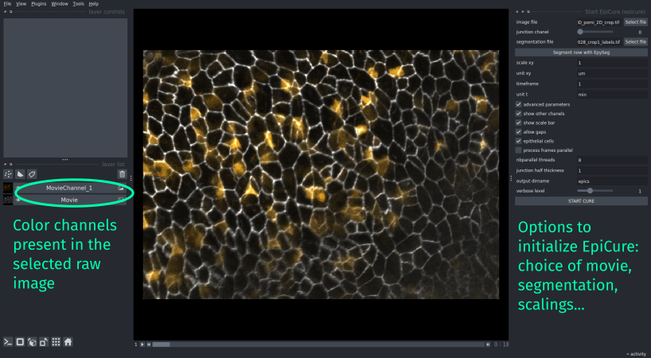

## Loading the movies

In the `Start EpiCure` step, you have a dedicated interface in the right part of the main interface.

The first file to choose is the movie containing the epithelial staining, with th `image file` parameter. 
It should be _2D(+time), .tif file_. 

If the file contains several chanels, the plugin should detect it and show the `junction_chanel` parameter, to choose the chanel that contains the junction staining. The plugin will display only this chanel. If you wish to also see the other chanels, use the option `show other chanels` in the [advanced parameters](#advanced-parameters) panel.

The second file is the segmentation of this movie (also a `.tif` file). It can be a binarized file of the junctions (skeletonized) or a labelled file (each cell is filled by a unique number).

_Note that if you haven't done the segmentation yet, there's an [additional option](#segment-with-epyseg) in EpiCure to directly run [EpySeg](https://github.com/baigouy/EPySeg) on the loaded movie._ 

## Advanced parameters

`output dirname` is the name of directory where all files generated by `EpiCure` will be saved. By default, it is placed in the input movie directory and called `epics`.

`show other chanels` will display the other chanels of the original movie.

`epithelial cells`: EpiCure has been developed and optimized for epithelia movies, with jointive cells. However, you can still use it for non jointive cells by unselecting this option. Note that some options might not be usable in that case

`process frames parallel`: if this is checked, some operations will be performed in parallel, processing multiple frames at the same time. The number of parallel threads run together is defined by the parameter `nbparallel_threads`, which is by default 75% of the computer's cpu numbers. 

`verbose level` defines the amount of messages that are printed to the user. By default, some information or warning messages are shown. If this parameter is put to 0, very few messages will appear while if it's put to 3, a lot of information useful for debugging will be shown.

