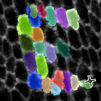

# EpiCure 

## Installation

You can install EpiCure with pip: `pip install epicure` in a python virtual environment.
For more precision about the installation, see the [Installation](./Installation.md) page.

## Usage

You can launch `EpiCure` in Napari by going to `Plugins>epicure>Start`. It will open an interface at the right side of the window where you can select the files to use. 

The first file to choose is the movie containing the epithelial staining. 
It should be _2D(+time), .tif file_. 

The second file is the segmentation of this movie (also a `.tif` file). It can be a binarized file of the junctions (skeletonized) or a labelled file (each cell is filled by a unique number).
_Note that if you haven't done the segmentation yet, there's an [additional option](./Segment-option.md) in EpiCure to directly run [EpySeg](https://github.com/baigouy/EPySeg) on the loaded movie._ 

Additionnal options are available to tune it to your usage, please see [Start epicure](./Start-epicure.md) page for more informations.

Then click on `START CURE` to start the main process.

## Main interface

When you have selected the two files, you can start editing by clicking on the `Start cure` button. It will open the two movies and open the interface that let you choose the steps to do:

* [Edit](https://gitlab.pasteur.fr/gletort/epicure/-/wikis/Edit): clean the segmentation or correct manually errors through EpiCure options :wrench: 
* [Inspect](https://gitlab.pasteur.fr/gletort/epicure/-/wikis/Inspect): determine cells suspicious of having an error, based on a few morphological or track features, or handle cellular events as divisions :mag: 
* [Track](https://gitlab.pasteur.fr/gletort/epicure/-/wikis/Track): links the labels from one frame to another to reconstruct the whole cell track. 
* [Output](https://gitlab.pasteur.fr/gletort/epicure/-/wikis/Output): measure/display cell or track features, export results to other plugins/softwares :outbox_tray: 
* [Display](./Display.md): display additional informations (segmentation skeleton, general informations...) or a spatial grid :window:  
* [Preferences](./Preferences.md): to set-up user-specific preferences as keyboard shortcuts :capital_abcd: 

## General principle

In EpiCure, the segmented cells are represented as labels: each cell is assigned a unique number, that will be conserved in all time frames that the cell is present. All pixels belonging to the cell are assigned to its value. 
They are represented in EpiCure in a Napari Label layer called `Segmentation`.

`Tracks` displays the trajectory of each cell by marking its centroid at each time frame. The value of a track is the same as the cell label.

`Inspect` helps the user to correct the segmentation by flagging some cell that might be wrongly segmented or handling other cellular events as divisions. 

EpiCure has several keyboard or mouse shortcuts to allow interactive corrections.
EpiCure shortcuts are linked to the `Segmentation` layer, so it should be selected in Napari for the shortcuts to work.

### Shortcut customisation

You can redefine EpiCure shortcuts to put your favorite keys instead of EpiCure default ones.
For this, open the `Preferences` option in `Napari>Plugins>EpiCure>Edit preferences`.
Choose the shortcuts to use and save them. 
See the [Preferences](./Preferences.md) page for more information.

??? warning "Restart to activate shortcut configuration" 
	The new shortcut configuration will be active only at the next EpiCure session. If you already have an EpiCure opened, restart it to apply the new shortcuts.

### General options

* Press <kbd>s</kbd> to save the current state of the segmentation. The file will be saved in the output folder, named `**imagename**_labels.tif` and can be reloaded later. Additional informations specific to EpiCure (cell groups, tracks graph (lineage), suspects) are saved at the same time, in a file named `**imagename**_epidata.pkl`. When the EpiCure files are re-opened, this file will be reloaded. 

* **Press <kbd>h</kbd> to show/hide the main `EpiCure` shortcuts** list. Press it several times to go through the different shortcut lists.

* Press <kbd>a</kbd> to open a new op-up window that list ALL the EpiCure shortcuts.

* Press <kbd>Shift-s</kbd> to save screenshots of the whole movie, with the current display. 

### Visualization :eye: shortcuts:

* The labels (cells) can be displayed as filled areas (put `contour` to 0) or only the contour lines can be shown with the `contour` option. 
Shortcut: **<kbd>Ctrl-c</kbd> or <kbd>Ctrl-d</kbd> to increase (or decrease) the `contour` size.** 
* To see only the current label (the pixels which have the value that is currently active in the `label` field), check the `show selected` box on the left panel.
* Click on the eye icon next to the `Movie` layer to show/hide it.
Shortcut: **press <kbd>v</kbd> to show/hide the movie** (visible).
* Click on the eye icon next to the `Segmentation` layer to show/hide it.
Shortcut: _press <kbd>b</kbd> to show/hide the segmentation_ (binary).
* **Press <kbd>5</kbd> to switch to zoom/moving mode**.
* **Press <kbd>c</kbd> to see only the movie layer**.
* **Press <kbd>g</kbd> to show/hide a grid to have a spatial repere**. See [Display](https://gitlab.pasteur.fr/gletort/epicure/-/wikis/Display) documentation for more details.

## Additional options

EpiCure also proposes specific options outside of the main pipeline:

* [Concatenate EpiCured movies](./Concatenate-epicured-movies.md): to combine two movies (from the same original one that was splitted before temporally) already analysed with EpiCure into one big epicured movie.
This is usefull for huge movie where the user prefered to split it in sub-movies temporally to reduce the loaded data size and allow for more responsiveness of the interface.
* [Segment](./Segment-option.md): by default, EpiCure doesn't perform segmentation to allow for more generability by using already existing solutions. This option links directly EpiCure with [napari-epyseg](https://github.com/gletort/napari-epyseg) plugin to perform the segmentation directly.

